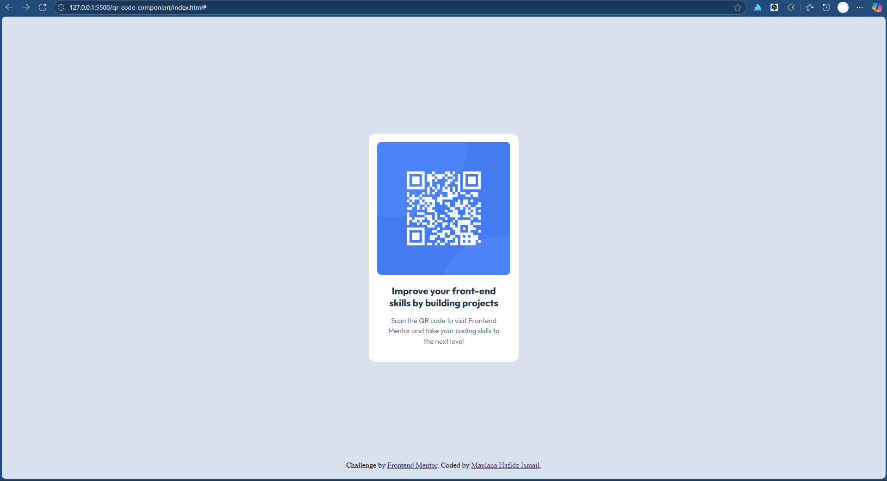

# Frontend Mentor - QR code component solution

This is a solution to the [QR code component challenge on Frontend Mentor](https://www.frontendmentor.io/challenges/qr-code-component-iux_sIO_H). Frontend Mentor challenges help you improve your coding skills by building realistic projects.

## Table of contents

- [Overview](#overview)
  - [Screenshot](#screenshot)
  - [Links](#links)
- [My process](#my-process)
  - [Built with](#built-with)
  - [What I learned](#what-i-learned)
  - [Continued development](#continued-development)
  - [Useful resources](#useful-resources)
- [Author](#author)
- [Acknowledgments](#acknowledgments)

## Overview

### Screenshot

Below are the screenshots of the solution I built on 100% Scale:

1. My Screen (1920 x 1080 pixels)

  

2. 4k Screen (3840 x 2160 pixels)

  

3. Mobile (375 x 667 pixels)

  

### Links

- Solution URL: [Solution URL here](https://github.com/imhefizh/FrontEnd-Lab/tree/main/qr-code-component)
- Live Site URL: [Live site URL here](https://imhefizh.github.io/FrontEnd-Lab/qr-code-component/)

## My process

### Built with

- Semantic HTML5 markup
- CSS custom properties
- Flexbox

### What I learned

1. Suprisingly, `<body>` element has it's own default margin by 8px on Microsoft Edge. Thus, I have to set it's margin to 0px for consistency.
2. `calc()` function is very hepful when I need to apply math especially on width and height of an element.
3. I'm a person who start from Tailwind firstly before Vanilla CSS, so it is a new insight for me that `text-wrap` apparently is `white-space`.
4. I just knew that `font-family` doesn't work if I don't provide callback font as it's second choice, or maybe it's just on my browser..I don't know.

### Useful resources

- Github Copilot - It really helped me for understanding specific problem.

## Author

- Website - [Maulana Hafidz Ismail](https://maulanahafidz.com)
- Frontend Mentor - [@imhefizh](https://www.frontendmentor.io/profile/imhefizh)

## Acknowledgments

Thanks for FrontEnd Mentor
